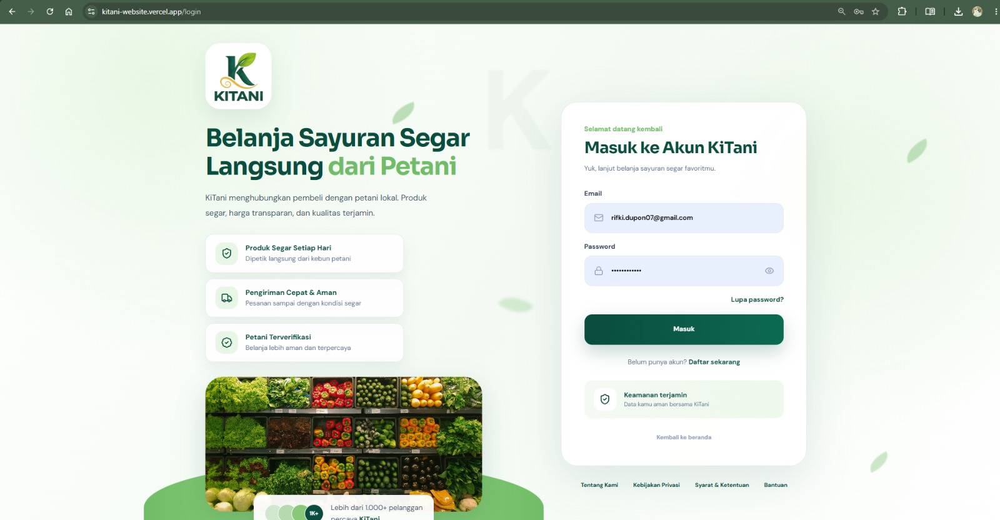
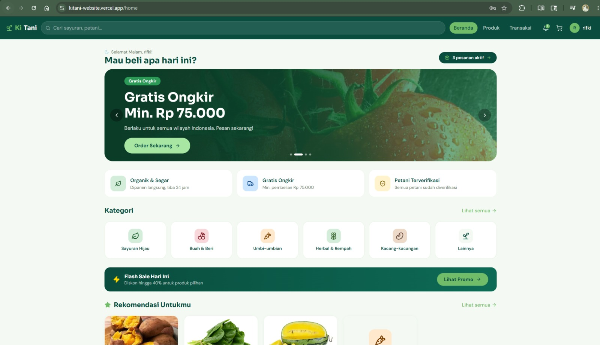
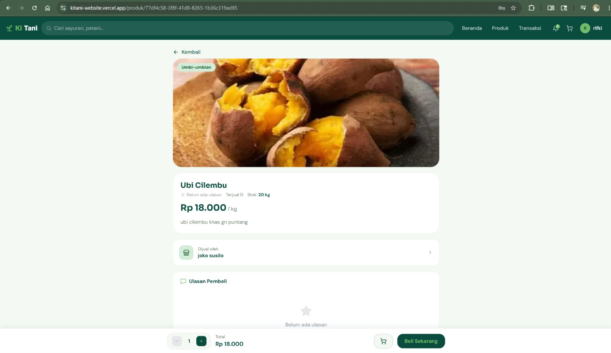
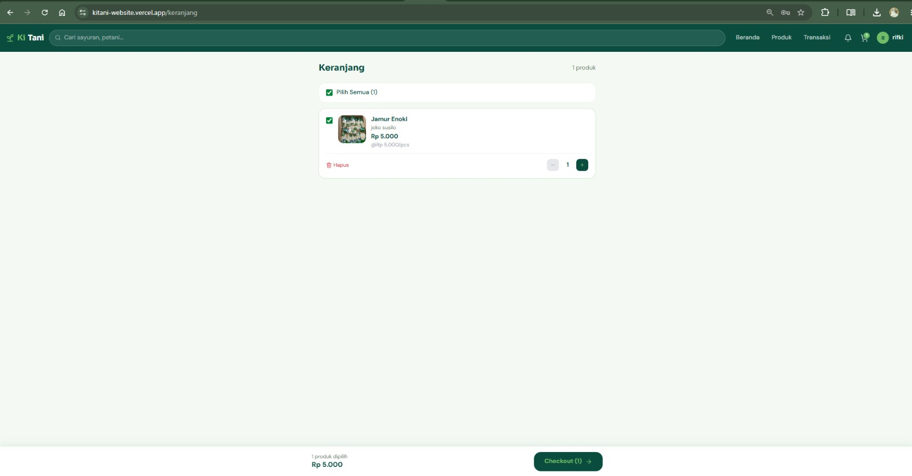
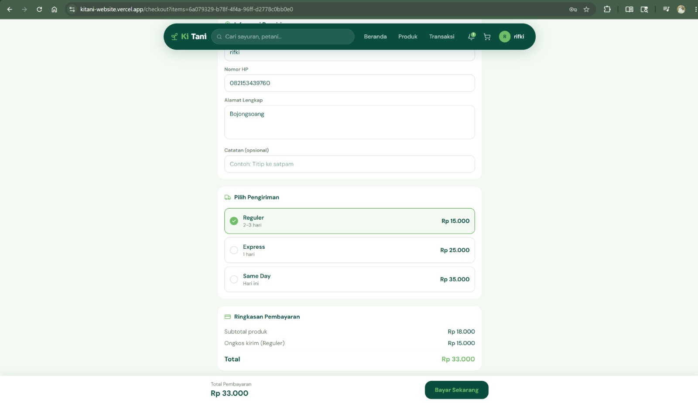
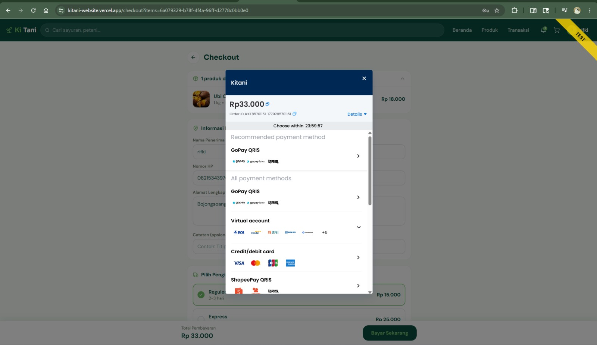

# Testing Metrics Report - KiTani Website

## 1. Deskripsi Singkat Proyek

KiTani Website merupakan aplikasi marketplace hasil pertanian berbasis
web yang mempertemukan pembeli dengan petani. Aplikasi menyediakan fitur
autentikasi pengguna, katalog produk, pencarian produk, detail produk,
keranjang belanja, checkout, integrasi pembayaran Midtrans, dan riwayat
transaksi. Pengujian dilakukan untuk memastikan seluruh fungsi utama
berjalan sesuai kebutuhan fungsional sistem.

------------------------------------------------------------------------

## 2. Fitur yang Diuji

1.  Login Pengguna
2.  Home Dashboard
3.  Pencarian & Detail Produk
4.  Keranjang Belanja
5.  Checkout & Payment Gateway (Midtrans)
6.  Riwayat Transaksi

------------------------------------------------------------------------

## 3. Test Case

  --------------------------------------------------------------------------
               No Fitur       Skenario      Expected           Status
                                            Result       
  --------------- ----------- ------------- ------------ -------------------
                1 Login       Login         Berhasil            PASS
                              menggunakan   masuk ke     
                              email dan     sistem       
                              password                   
                              valid                      

                2 Login       Password      Pesan error         PASS
                              salah         tampil       

                3 Login       Email kosong  Validasi            PASS
                                            email tampil 

                4 Login       Password      Validasi            PASS
                              kosong        password     
                                            tampil       

                5 Home        Membuka       Dashboard           PASS
                  Dashboard   dashboard     tampil       
                                            dengan benar 

                6 Produk      Mencari       Produk              PASS
                              produk        ditemukan    
                                            sesuai kata  
                                            kunci        

                7 Produk      Membuka       Informasi           PASS
                              detail produk produk       
                                            tampil       
                                            lengkap      

                8 Keranjang   Menambahkan   Produk              PASS
                              produk        berhasil     
                                            masuk ke     
                                            keranjang    

                9 Keranjang   Mengubah      Subtotal            PASS
                              jumlah produk berubah      
                                            sesuai       
                                            quantity     

               10 Keranjang   Menghapus     Produk              PASS
                              produk        berhasil     
                                            dihapus      

               11 Checkout    Mengisi data  Data                PASS
                              penerima      berhasil     
                                            disimpan     

               12 Checkout    Memilih       Ongkos kirim        PASS
                              metode        diperbarui   
                              pengiriman                 

               13 Checkout    Klik **Bayar  Popup               PASS
                              Sekarang**    Midtrans     
                                            berhasil     
                                            muncul       

               14 Payment     Menampilkan   Metode              PASS
                  Gateway     metode        pembayaran   
                              pembayaran    tampil       

               15 Transaksi   Membuka       Riwayat             PASS
                              riwayat       transaksi    
                              transaksi     tampil       
  --------------------------------------------------------------------------

------------------------------------------------------------------------

## 4. Perhitungan Metrik Pengujian

### 4.1 Total Test Case

**15 Test Case**

### 4.2 Pass Rate

-   Jumlah PASS = **15**
-   Total Test Case = **15**

**Pass Rate = (15 / 15) × 100% = 100%**

### 4.3 Fail Rate

-   Jumlah FAIL = **0**
-   Total Test Case = **15**

**Fail Rate = (0 / 15) × 100% = 0%**

### 4.4 Defect Count

  Kategori          Jumlah Keterangan
  --------------- -------- -----------------------------------------
  Critical               0 Tidak ditemukan bug kritis
  Major                  0 Tidak ditemukan bug mayor
  Minor                  0 Tidak ditemukan bug minor
  **Total Bug**      **0** Tidak ditemukan defect selama pengujian

### 4.5 Defect Density

Jumlah Bug = **0**

Jumlah Fitur = **6**

**Defect Density = 0 / 6 = 0 bug per fitur**

------------------------------------------------------------------------

## 5. Dokumentasi Bukti Pengujian

### Gambar 1. Halaman Login

### Gambar 2. Home Dashboard

### Gambar 3. Detail Produk

### Gambar 4. Keranjang Belanja

### Gambar 5. Checkout

### Gambar 6. Payment Gateway Midtrans

------------------------------------------------------------------------

## 6. Analisis Hasil Pengujian

Pengujian terhadap aplikasi **KiTani Website** dilakukan untuk memastikan bahwa seluruh fitur utama telah berjalan sesuai dengan kebutuhan fungsional yang telah ditetapkan pada tahap perancangan dan pengembangan sistem. Pengujian difokuskan pada enam fitur utama, yaitu **Login Pengguna**, **Home Dashboard**, **Pencarian dan Detail Produk**, **Keranjang Belanja**, **Checkout beserta Payment Gateway Midtrans**, serta **Riwayat Transaksi**. Sebanyak lima belas *test case* disusun berdasarkan skenario penggunaan yang umum dilakukan oleh pengguna. Setiap skenario diuji dengan membandingkan hasil aktual (*actual result*) terhadap hasil yang diharapkan (*expected result*). Berdasarkan hasil pengujian yang telah dilakukan, seluruh *test case* memperoleh status **PASS**, sehingga menghasilkan **Pass Rate sebesar 100%** dan **Fail Rate sebesar 0%**.

Pada fitur **Login Pengguna**, sistem berhasil melakukan proses autentikasi menggunakan kombinasi email dan kata sandi yang valid. Selain itu, sistem juga mampu memberikan validasi ketika pengguna memasukkan data yang tidak sesuai, seperti password yang salah maupun kolom input yang dikosongkan. Hasil tersebut menunjukkan bahwa mekanisme autentikasi dan validasi input telah berjalan dengan baik sehingga dapat meminimalkan kesalahan penggunaan pada tahap awal interaksi pengguna dengan sistem.

Pengujian pada fitur **Home Dashboard**, **Pencarian Produk**, dan **Detail Produk** menunjukkan bahwa seluruh informasi dapat ditampilkan secara benar sesuai dengan data yang tersedia pada basis data. Proses pencarian mampu menampilkan produk berdasarkan kata kunci yang dimasukkan pengguna, sedangkan halaman detail produk berhasil menyajikan informasi produk secara lengkap. Selama pengujian berlangsung, tidak ditemukan kesalahan tampilan (*interface error*), kegagalan navigasi, maupun kesalahan pengambilan data yang dapat mengganggu fungsi utama aplikasi.

Fitur **Keranjang Belanja** juga berhasil menjalankan seluruh fungsinya dengan baik. Pengguna dapat menambahkan produk ke keranjang, mengubah jumlah produk, serta menghapus produk dari keranjang tanpa mengalami kendala. Sistem secara otomatis memperbarui subtotal dan total pembayaran sesuai perubahan jumlah produk sehingga perhitungan harga tetap konsisten. Pada proses **Checkout**, pengguna dapat mengisi data penerima, memilih metode pengiriman, serta melanjutkan proses pembayaran melalui **Payment Gateway Midtrans**. Berdasarkan hasil pengujian, popup pembayaran Midtrans berhasil ditampilkan dan seluruh alur transaksi berjalan sesuai dengan proses bisnis yang telah dirancang. Selain itu, fitur **Riwayat Transaksi** mampu menampilkan data transaksi pengguna dengan baik sehingga pengguna dapat melihat status maupun riwayat pembelian yang telah dilakukan.

Selama proses pengujian tidak ditemukan bug maupun kesalahan yang memengaruhi fungsi utama aplikasi. Oleh karena itu, nilai **Defect Count** untuk kategori **Critical**, **Major**, maupun **Minor** adalah **0**, sedangkan nilai **Defect Density** juga sebesar **0 bug per fitur**. Hasil tersebut menunjukkan bahwa implementasi fitur yang diuji telah memenuhi kebutuhan fungsional sistem. Meskipun demikian, pengujian yang dilakukan pada penelitian ini masih terbatas pada aspek fungsional. Oleh karena itu, sebelum aplikasi digunakan secara luas, disarankan untuk melakukan pengujian lanjutan seperti **Performance Testing**, **Security Testing**, **Compatibility Testing**, dan **User Acceptance Testing (UAT)** agar kualitas perangkat lunak dapat dievaluasi secara lebih menyeluruh.

Berdasarkan seluruh hasil pengujian yang telah dilakukan, dapat disimpulkan bahwa **KiTani Website** telah memenuhi kebutuhan fungsional sistem dengan baik. Seluruh fitur utama berhasil dijalankan sesuai skenario pengujian tanpa ditemukan *defect* selama proses pengujian. Dengan demikian, aplikasi dinilai **layak untuk memasuki tahap implementasi atau rilis**, dengan tetap mempertimbangkan pelaksanaan pengujian nonfungsional sebagai langkah peningkatan kualitas perangkat lunak di masa mendatang.
------------------------------------------------------------------------

## 7. Jawaban Pertanyaan Analisis

### 1. Fitur mana yang paling banyak gagal?

Tidak ada. Seluruh fitur memperoleh status **PASS**.

### 2. Apa penyebabnya?

Implementasi fitur telah sesuai dengan kebutuhan sistem dan seluruh
skenario pengujian berhasil dijalankan.

### 3. Bagaimana cara memperbaikinya?

Belum diperlukan perbaikan fungsional. Pengembangan selanjutnya
difokuskan pada optimasi performa, keamanan, dan kompatibilitas.

### 4. Apa prioritas perbaikannya?

Prioritas berikutnya adalah pengujian nonfungsional seperti performance
testing, security testing, dan UAT.

### 5. Apakah aplikasi layak dirilis minggu ini?

Ya. Berdasarkan hasil pengujian fungsional, aplikasi layak dirilis
karena seluruh test case berhasil dijalankan.

------------------------------------------------------------------------

## 8. Kesimpulan

Berdasarkan 15 test case yang telah dijalankan, seluruh fitur utama
KiTani Website berhasil memenuhi kebutuhan fungsional sistem. Aplikasi
memperoleh **Pass Rate sebesar 100%**, **Fail Rate sebesar 0%**,
**Defect Count sebesar 0**, dan **Defect Density sebesar 0 bug per
fitur**. Hasil tersebut menunjukkan bahwa aplikasi berada dalam kondisi
stabil pada aspek fungsional dan siap untuk memasuki tahap pengujian
lanjutan maupun proses rilis.
